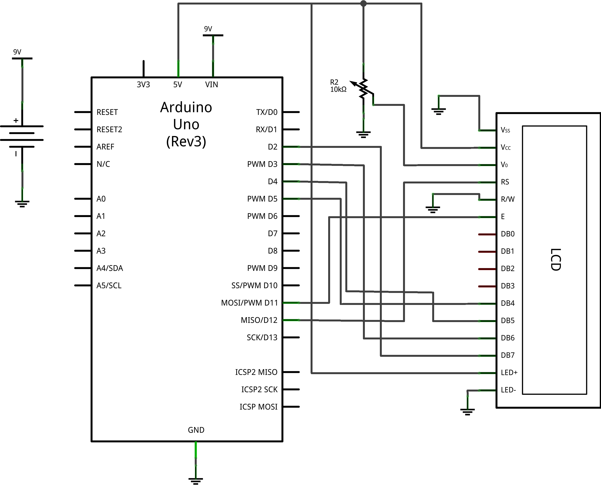
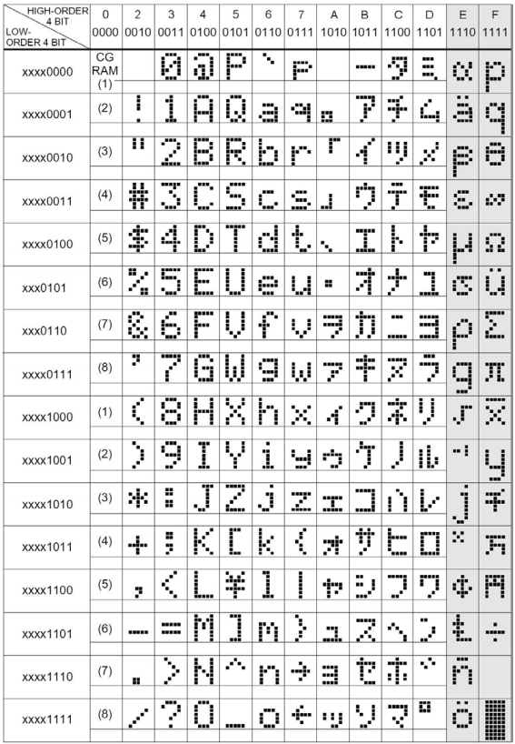
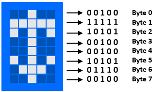

### LCD

**Objetivo**: Utilizar un LCD de 16x2 o 16x4 (16 carácteres x 2 o 4 líneas) para mostrar información

#### Información necesaria

Los displays tienen 16 pins, (14 si la pantalla no es retroiluminada).

| Pin | Símbolo | Nivel | Función | Descripción |
| --- | ------- | ----- | ------- | ----------- |
| 1 | VSS | 0V | Power GND | Alimentación +5V |
| 2 | VDD | +5V | Power supply for logic | Alimentación +5V |
| 3 | V0 | - | Operation voltage for LCD | Voltaje para el contraste de la pantalla +5V | 
| 4 | RS | HL | H: Data L: Instruction code | RS (Register Select) controla la memoria del display |
| 5 | R/W | HL | H: Read L: Write | R/W (Read/Write) Selecciona modo escritura o modo lectura |
| 6 | E | HL | Enable signal | Habilitar o deshabilitar la escritura del display |
| 7 | DB0 | HL | Data bus line | Bus de datos de 8 bits |
| 8 | DB1 | HL | Data bus line | Bus de datos de 8 bits |
| 9 | DB2 | HL | Data bus line | Bus de datos de 8 bits |
| 10 | DB3 | HL | Data bus line | Bus de datos de 8 bits |
| 11 | DB4 | HL | Data bus line | Bus de datos de 8 bits |
| 12 | DB5 | HL | Data bus line | Bus de datos de 8 bits |
| 13 | DB6 | HL | Data bus line | Bus de datos de 8 bits |
| 14 | DB7 | HL | Data bus line | Bus de datos de 8 bits |
| 15 | BLA | +5V | Power supply for LED backlight | Habilitar retroiluminación aplicando +5V |
| 16 | BLK | 0V | Power supply for LED backlight | Habilitar retroiluminación aplicando +5V |

#### Librería

Descarga la librería [aquí](https://www.arduino.cc/en/Reference/LiquidCrystal)

#### Funciones básicas

– LiquidCrystal “nombre_variable” (rs, enable, d0, d1, d2, d3, d4, d5, d6, d7): A través de esta función se crea una variable de tipo LiquidCrystal. Entre paréntesis pondremos los pins del Arduino correspondientes a los pins del display (RS, Enable y los 8 pins de bus de datos). Con esta configuración se usa la totalidad del bus de datos.

– LiquidCrystal “nombre_variable” (rs, enable, d4, d5, d6, d7): Igual que la anterior función pero solo usando 4 bits del bus de datos.

– begin(columnas, filas): Inicializa la interfaz del LCD y establece las dimensiones de la pantalla.

– setCursor(columna, fila): Posicionar el cursor de la pantalla LCD.

– print(“mensaje”): Escribe texto a la pantalla LCD.

– clear(): Limpia la pantalla LCD y posiciona el cursor en la parte superior izquierda.


#### Esquema





#### Código

```cpp

#include <LiquidCrystal.h> //Importamos la librería LiquidCrystal
 
LiquidCrystal lcd(12, 11, 5, 4, 3, 2); //Creamos la variable y establecemos los pins del display
 
void setup()
{
  lcd.begin(16, 2); //Inicializamos el display configurando 16 columnas por 2 filas
  lcd.setCursor(0,0); //Ponemos el cursor en la primera fila a la izquierda
  lcd.print("Inicializando..."); //Imprimimos un mensaje inicial
  delay(2000); //Esperamos 2 segundos
  lcd.clear(); //Borramos lo que pone a la pantalla
}
 
void loop()
{
  //Primera fila
  lcd.setCursor(0, 0);
  lcd.print("BIENVENIDOS A");
  delay(2000);
 
  //Segunda fila
  lcd.setCursor(0, 1);
  lcd.print("EFFINNO");
  delay(2000);
 
  lcd.clear(); //Borramos lo que pone a la pantalla
}
```

### Creando tu propia imagen




Cada una de las ocho líneas del carácter es 1 byte. Por lo tanto, para crear un carácter tenemos que usar 8 bytes. Para entender esto, vamos a crear el siguiente carácter:



```cpp
byte caracter[8] = {
    B00100,
    B11111,
    B10101,
    B00100,
    B00100,
    B10101,
    B01110,
    B00100
  };
```

Luego, a través de la función creatChar() de la librería LiquidCrystal se crea el carácter con los 8 bytes del array. Y finalmente, a través de la función write() se escribe el carácter en el display.

Vamos a hacer un ejemplo para entenderlo mejor. Crearemos un carácter móvil, que se irá moviendo constantemente. Haremos una cara que vaya cambiando su expresión de alegre, normal y enfadado. Cada uno de estos tres estados de expresión será un carácter que crearemos. El código sería el siguiente:

```cpp
/*
  www.diymakers.es
  by A.García
  17/08/14
  Aprender a usar un Display LCD
  Tutorial en: http://diymakers.es/aprender-usar-un-display-lcd/
*/
 
#include <LiquidCrystal.h> //Importamos la librería LiquidCrystal
 
LiquidCrystal lcd(12, 11, 5, 4, 3, 2); //Creamos la variable y establecemos los pins del display
 
//Creamos los 3 arrays de 8 bytes de los 3 caracteres
byte alegre[8] = {
    B00000,
    B00000,
    B01010,
    B00000,
    B10001,
    B01110,
    B00000,
    B00000
  };
 
byte normal[8] = {
    B00000,
    B00000,
    B01010,
    B00000,
    B00000,
    B11111,
    B00000,
    B00000
  };
 
byte enfadado[8] = {
    B00000,
    B00000,
    B01010,
    B00000,
    B00000,
    B01110,
    B10001,
    B00000
  };
 
void setup()
{
  //Creamos los 3 caracteres asignandoles un número a cada uno
  lcd.createChar(0, alegre);
  lcd.createChar(1, normal);
  lcd.createChar(2, enfadado);
 
  lcd.begin(16, 2); //Inicializamos el display configurando 16 columnas por 2 filas
  lcd.setCursor(0,0); //Ponemos el cursor en la primera fila a la izquierda
  lcd.print("Inicializando..."); //Imprimimos un mensaje inicial
  delay(2000); //Esperamos 2 segundos
  lcd.clear(); //Borramos lo que pone a la pantalla
}
 
void loop()
{
  //Creamos un bucle para que cambien los caracteres automaticamente
  for(int i=0; i<3; i++)
  {
    lcd.setCursor(7, 1);
    lcd.write(byte(i)); //Se escribe el caracter llamandolo a través de su número
    delay(500);
    lcd.clear();
  }
 
  lcd.clear();
}
```
