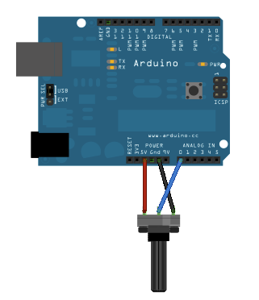
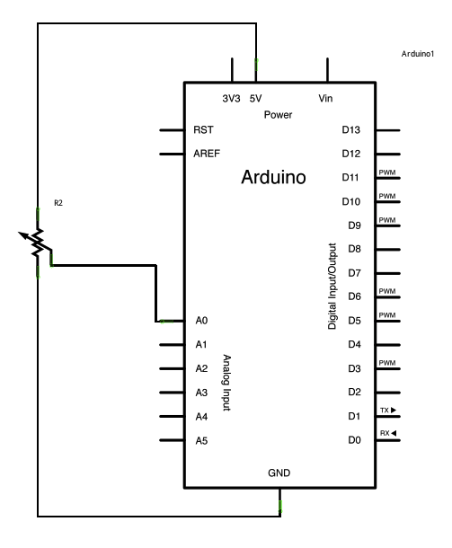

# Basicos

## Lectura analógica de un potenciómetro

Un potenciómetro es una unidad mecánica que permite variar la cantidad de resistencia cuando se gira la ruleta.
El voltaje atraviesa el potenciómetro y se transforma a un valor analógico de entrada hacia el _board_. 
Es posible medir la resistencia producida por el potenciómetro como valor analógico.

El objetivo de este _básico_ es monitorizar el estado del potenciómetro después de establecer comunicación entre Arduino y el IDE.

### Circuito

La conexión del potenciómetro al circuito se debe hacer atendiendo al esquema de la imagen.

Girando el eje del potenciómetro cambia la cantidad de resistencia, cambiando el voltaje al pin central del potenciómetro.
Cuando la resistencia entre el pin central y el pin conectado a 5 voltios es cercano a cero + la resistencia en el otro lado es cercana a 10 kOhm, el voltaje en el pin central es de 5 voltios.

Cuando las resistencias se invierten, la tensión en el pin central es próximo a 0. Este voltaje es el valor analógico que vamos a leer como entrada.

Arduino tiene un circuito ADC (Analog to Digital Converter) que lee el valor del voltaje y lo convierte en un valor entre 0-1023. La función _analogRead()_ devolverá el valor entre 0-1023 que es proporcional a la cantidad de tensión aplicado al pin.

### Esquemas





### Código

En la parte del ```setup``` se establecerá el _serial_ de comunicación.

En la parte del ```loop``` se define una variable para guardar el valor recogido y un comando para enviar la variable hasta el ordenador.

```
void setup() {
  Serial.begin(9600);
}

void loop() {
  int sensorValue = analogRead(A0);
  Serial.println(sensorValue);
  delay(1);
}
```
