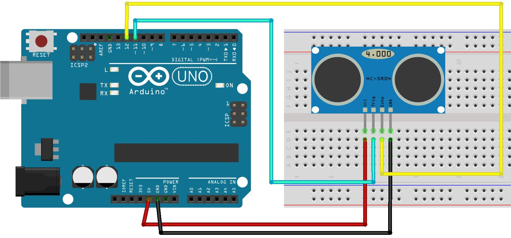

# Funcionamiento

HC-SR04 es un sensor ultrasónico que utiliza sonar para determinar a la distanca a la que un objeto está y su rango puede llegar hasta 4 metros.

## Caracteristicas

Alimentación:+5V DC

Corriente en reposo : <2mA

Corriente de trabajo: 15mA

Ángulo efectivo: <15°

Rango de medida : 2cm – 400 cm

Resolución : 0.3 cm

Ángulo de medida: 30 degree

Ancho de pulso: 10uS

Dimensiones: 45mm x 20mm x 15mm

## Funcionamiento

El transmisor envia una señal, un sonido de alta frecuencia, la señal rebota en el objeto y la onda reflejada vuelve al transmisor, captándola.

## Esquema del sensor


VCC: Conexión de +5VDC

Trig: Trigger (entrada)

Echo: Echo (salida)

GND: Tierra



## Codigo

```javascript

int trigPin = 11;    //Trig - emisor
int echoPin = 12;    //Echo - receptor
long duration, cm, inches;
 
void setup() {
  //Puerto para comunicaciones
  Serial.begin (9600);
  //Definir entradas y salidas
  pinMode(trigPin, OUTPUT);
  pinMode(echoPin, INPUT);
}
 
void loop()
{
 
 
  // The sensor is triggered by a HIGH pulse of 10 or more microseconds.
  // Give a short LOW pulse beforehand to ensure a clean HIGH pulse:
  digitalWrite(trigPin, LOW);
  delayMicroseconds(5);
  digitalWrite(trigPin, HIGH);
  delayMicroseconds(10);
  digitalWrite(trigPin, LOW);
 
  // Read the signal from the sensor: a HIGH pulse whose
  // duration is the time (in microseconds) from the sending
  // of the ping to the reception of its echo off of an object.
  pinMode(echoPin, INPUT);
  duration = pulseIn(echoPin, HIGH);
 
  // convert the time into a distance
  cm = (duration/2) / 29.1;
  inches = (duration/2) / 74; 
  
  Serial.print(inches);
  Serial.print("in, ");
  Serial.print(cm);
  Serial.print("cm");
  Serial.println();
  
  delay(250);
}

```

## Utilizando librería NewPing

```javascript

/*
 * Posted on http://randomnerdtutorials.com
 * created by http://playground.arduino.cc/Code/NewPing
*/

#include <NewPing.h>
 
#define TRIGGER_PIN 11
#define ECHO_PIN 12
#define MAX_DISTANCE 200
 
NewPing sonar(TRIGGER_PIN, ECHO_PIN, MAX_DISTANCE); // NewPing setup of pins and maximum distance.
 
void setup() {
   Serial.begin(9600);
}
 
void loop() {
   delay(50);
   unsigned int uS = sonar.ping_cm();
   Serial.print(uS);
   Serial.println(“cm”);
}

```
