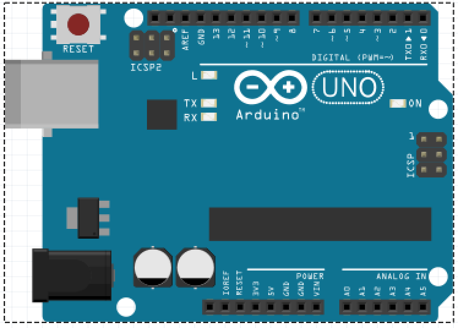
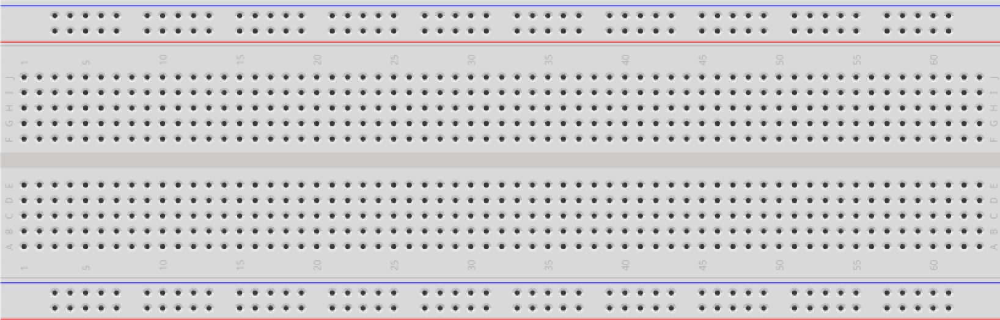
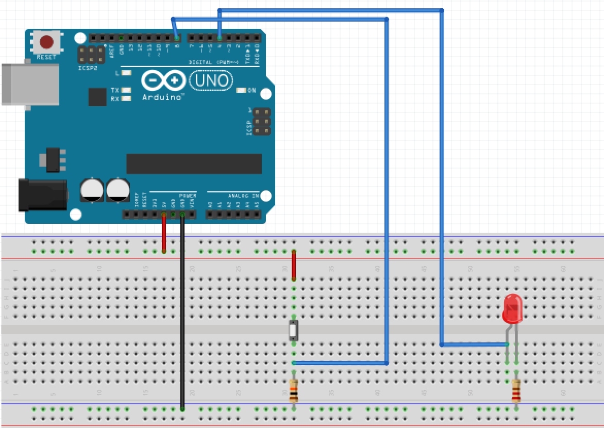
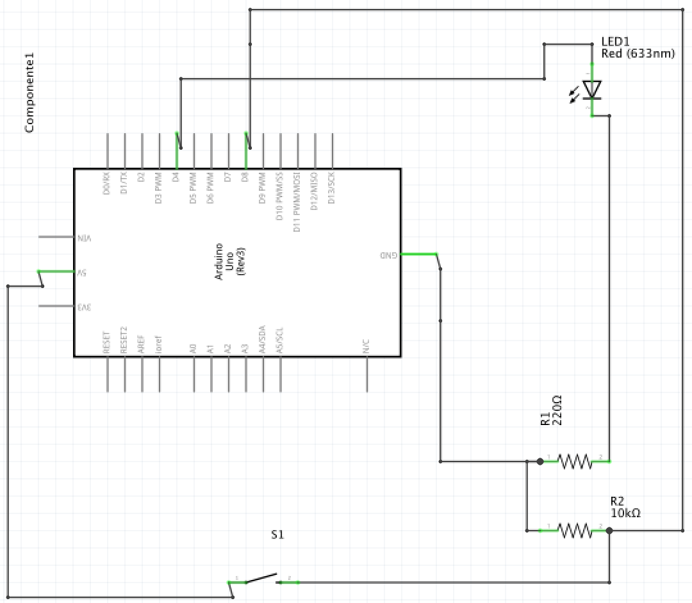
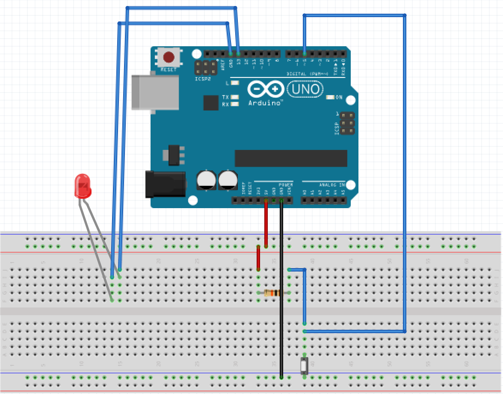
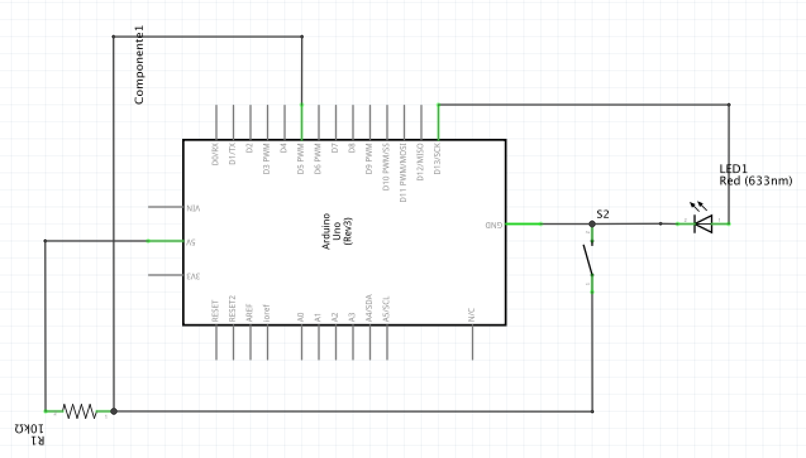
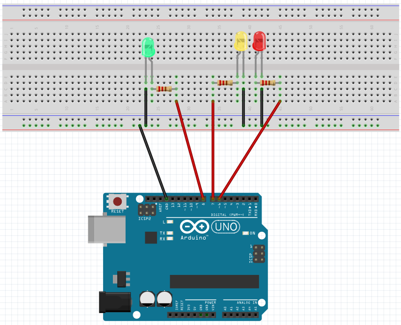
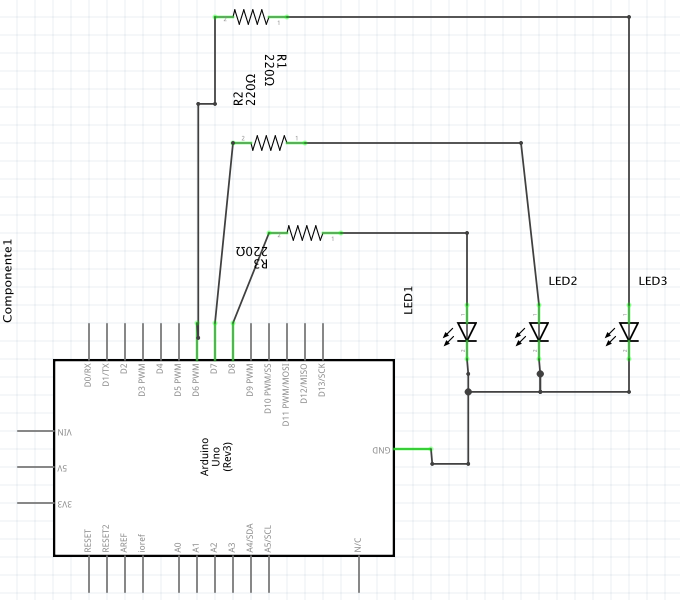

## Proyecto Arduino

Esta página ha sido creada con el propósito de recoger la información que nos conduzca al éxito de manejar las diferentes herramientas de desarrollo a la hora de llevar a cabo un proyecto Arduino.

## Introducción

El _board_ Arduino, no es más que un procesador al que le conectamos algunas entradas (desde teclado, ratón, cámara). 
El procesador utiliza la información de las entradas para generar salidas (a un monitor, por ejemplo).

A través de sensores o captadores de datos, obtendremos magnitudes físicas (velocidad, aceleración, temperatura, fuerza, presión, inclinación) que se pueden convertir en electricidad que Arduino puede medir.

## Electrónica básica

Simbología [aquí](http://www.electronicaestudio.com/simbologia.htm)

Ley de Ohm y componentes de electrónica básica [aquí](https://aprendiendoarduino.wordpress.com/2016/06/26/componentes-electronicos/)

Ley de corriente y caudal de flujo [aquí](http://hyperphysics.phy-astr.gsu.edu/hbasees/electric/watcir2.html)

## Características de los pines en el _board_

En el _board_ nos encontramos dos filas de pines diferentes.



Arriba, los pines digitales, numerados de 0 al 13. Solo pueden tener 2 estados y pueden ser tanto entradas como salidas. 

Abajo, los pines analógicos, de 0 a 5. Están pensados para *captar* aquello que varía en su voltaje y solo pueden ser entradas. 

A la izquierda de los pines analógicos, las salidas de voltaje 5V, 3.3V, GRD (tierra).

## Características del _protoboard_

Existen dos secciones con diferente diposición, una horizontal y otra vertical. Los 5 puntos que conforman cada línea vertical están conectados entre sí al mismo punto. Cada hilera horizontal está conectada a un mismo punto también.



## Conectando el _board_

Desde la IDE de Arduino, en el menú superior:

Elegimos nuestro modelo
```
Tools > Board > 
```
Elegimos el puerto COM al que está conectado el dispositivo
```
Tools > Serials Port >
```
## Funciones básicas de Arduino

### La función setup()

La utilizamos para configurar salidas y entradas.

```
void setup() {

}
```

### La función loop()

Utilizada para el código que está en constante ejecución.

```
void setup() {

}
```
Más, en la [Wiki de Funciones](https://github.com/nicorl/effinno/wiki/Manual-de-funciones)

## Proyecto 0

**Objetivo**: hacer parpadear el LED que trae la placa por defecto.

Información necesaria: Arduino UNO trae un LED integrado en el pin digital 13.

Ya que los pines digitales pueden ser E/S, en el *setup* hay que declarar que utilizaremos el pin 13 como salida.

```javascript
void setup() { // Código que se ejecuta una única vez.
  pinMode(13, OUTPUT); // Declaración del pin 13 como salida. // LED_BUILTIN
}

void loop(){ // Código que se ejecuta constantemente.
  digitalWrite(13, HIGH); // Se enciende el LED // LED_BUILTIN
  delay(1000); // Espera 1 segundo
  digitalWrite(13, LOW); // Se apaga el LED // LED_BUILTIN
  delay(1000); // Espera 1 segundo
}
```
Descarga este código [aquí](https://create.arduino.cc/editor/nicorl/479d5c08-82a6-4aa8-a39e-5da9fe516b02/preview)

## Proyecto 0.1

**Objetivo**: encender y apagar el LED mediante un botón.

Componentes necesarios: Placa Arduino, LED, 2 resistencias, Botón y Protoboard.

El LED tiene polaridad, por lo que se conecta de una manera concreta. El extremo plano (el cátodo, la parte negativa) va a tierra y le conectaremos ahí una resistencia. El lado positivo (el ánodo) lo conectaremos directamente a un pin digital.





```javascript
int estado = 0; // Declarar una variable tipo Integer (numérica entero, 0, 1, 2, 3).

void setup() {
    pinMode(8, INPUT)   // Declarar el botón como entrada
    pinMode(4, OUTPUT)  // Declarar el LED como salida
}

void loop() {
    estado = digitalRead(8); // Leer el pin 8 y guardarlo enla variable 'estado'
    if(estado == HIGH){ // Compara si la variable estado es == HIGH
      digitalWrite(4, HIGH); // Encender el LED
    } else { // En caso de que estado no sea HIGH
      digitalWrite(4, LOW); // Apagar el LED
    }
}
```
Descarga este código [aquí](https://create.arduino.cc/editor/nicorl/93e95293-c2b8-403e-b50d-0ed53ce50dc3/preview)

### `Mejora de código`

```javascript
int estado = 0;         // Declarar variables
int estadoAnterior = 0;
int salida = 0;

void setup() {
    pinMode(8, INPUT)   // Declarar el botón como entrada
    pinMode(4, OUTPUT)  // Declarar el LED como salida
}

void loop() {
    estado = digitalRead(8);                           // Leer valor del PIN 8
    
    if((estado == HIGH) && (estadoAnterior == LOW)) {  // Check Valor PIN = 8 y antes estadoAnterior = 0
    salida = 1 - salida;                               // salida = 1 o 0
    delay(20);                                         // Espera
    }
    
    estadoAnterior = estado;                           // Donde antes estadoAnterior = 0, ahora = 1.
    
    if(salida == 1){                                   // Si salida = 1
      digitalWrite(4, HIGH);                           // Encender LED
    } else {                                           // Si salida != 1
      digitalWrite(4, LOW);                            // Apagar LED
    }
}
```
Descarga este código [aquí](https://create.arduino.cc/editor/nicorl/65353358-6e26-4849-ae9e-69f7e2ab376e/preview)

### Alternativa 2 - Proyecto 0.1

Utilizando el pin 13 como salida, evitamos incluir una resistencia extra ya que la propia placa ya la tiene incluida.





```javascript
int pinLED = 13;              // Crear variable para asignar el Pin del LED
int pinEntrada = 5;           // Crear variable para asignar el Pin del botón
int valor = 0;                // Variable para leer el estado del Pin

void setup() {
  pinMode(pinLED, OUTPUT);    // Declarar LED como salida
  pinMode(pinEntrada, INPUT); // Declarar botón como entrada
}

void loop() {
  valor = digitalPin(pinEntrada); // Recoger el valor del pin
  if (valor == HIGH) {            // ¿Es el valor del pin == HIGH == 1 == PRESIONADO?
    digitalWrite(pinLED, LOW);    // Apagar el LED
  } else {
    digitalWrite(pinLED, LOW);    // Apagar el LED
    delay(500);
    digitalWrite(pinLED, HIGH);   // Encender el LED
    delay(500);
  }
}

```
Descarga este código [aquí](https://create.arduino.cc/editor/nicorl/7c62f97e-a9fa-4e3a-9127-4b9b51d28010/preview)

## Secuencia básica de 3 LEDs

**Objetivo**: Encender 3 LEDs, por orden y con una cadencia determinada.

Componentes necesarios: Placa Arduino, 3 LEDs, 3 resistencias y protoboard.





```javascript
int led1 = 6; //Define la salida del led 1 (salida 6)
int led2 = 7; //Define la salida del led 2 (salida 7)
int led3 = 8; //Define la salida del led 3 (salida 8)

void setup() {
  pinMode(led1, OUTPUT); //Declara el led 1 como salida
  pinMode(led2, OUTPUT); //Declara el led 2 como salida
  pinMode(led3, OUTPUT); //Declara el led 3 como salida
  digitalWrite(pin1, LOW); //Apaga el led 1
  digitalWrite(pin2, LOW); //Apaga el led 2
  digitalWrite(pin3, LOW); //Apaga el led 3
}

void loop() {
  digitalWrite(pin1, HIGH); // Enciende led 1
  delay(200);               // Espera 200 ms
  digitalWrite(pin1, LOW);  // Apaga led 1
  digitalWrite(pin2, HIGH); // Enciende led 2
  delay(200);               // Espera 200 ms
  digitalWrite(pin2, LOW);  // Apaga led 2
  digitalWrite(pin3, HIGH); // Enciende led 3
  delay(200);               // Espera 200 ms
  digitalWrite(pin3, LOW);  // Apaga led 3
}

```

Descarga este código [aquí](https://create.arduino.cc/editor/nicorl/ee5ebd67-4c3e-41a9-8eef-c0f36c4ed7c6/preview)  

### Lectura de un pulsador

### Encuesta del curso

[Encuesta](https://docs.google.com/forms/d/18nUbC7JfNeWw9XNoktKNvuYjwp0l7hzUayIeoaZf28Y)

### Webs de interés

Desde [Arduino](https://www.arduino.cc/en/Main/Software) podemos descargar el IDE de desarrollo con el que trabajaremos.

Todo el código del proyecto [Effinno](https://github.com/nicorl/effinno).
