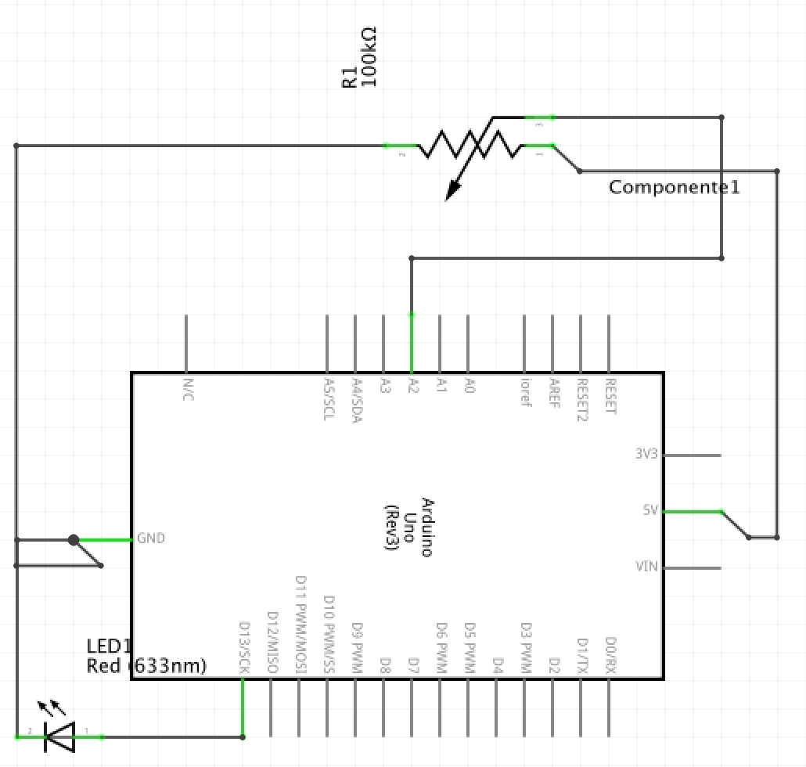

## Proyecto Arduino

Esta página ha sido creada con el propósito de recoger la información que nos conduzca al éxito de manejar las diferentes herramientas de desarrollo a la hora de llevar a cabo un proyecto Arduino.

## Introducción

El _board_ Arduino, no es más que un procesador al que le conectamos algunas entradas (desde teclado, ratón, cámara). 
El procesador utiliza la información de las entradas para generar salidas (a un monitor, por ejemplo).

A través de sensores o captadores de datos, obtendremos magnitudes físicas (velocidad, aceleración, temperatura, fuerza, presión, inclinación) que se pueden convertir en electricidad que Arduino puede medir.

## Electrónica básica

Simbología [aquí](http://www.electronicaestudio.com/simbologia.htm)

Ley de Ohm y componentes de electrónica básica [aquí](https://aprendiendoarduino.wordpress.com/2016/06/26/componentes-electronicos/)

Ley de corriente y caudal de flujo [aquí](http://hyperphysics.phy-astr.gsu.edu/hbasees/electric/watcir2.html)

## Características de los pines en el _board_

En el _board_ nos encontramos dos filas de pines diferentes.


Arriba, los pines digitales, numerados de 0 al 13. Solo pueden tener 2 estados y pueden ser tanto entradas como salidas. 

Abajo, los pines analógicos, de 0 a 5. Están pensados para *captar* aquello que varía en su voltaje y solo pueden ser entradas. 

A la izquierda de los pines analógicos, las salidas de voltaje 5V, 3.3V, GRD (tierra).

## Características del _protoboard_

Existen dos secciones con diferente diposición, una horizontal y otra vertical. Los 5 puntos que conforman cada línea vertical están conectados entre sí al mismo punto. Cada hilera horizontal está conectada a un mismo punto también.


## Conectando el _board_

Desde la IDE de Arduino, en el menú superior:

Elegimos nuestro modelo
```
Tools > Board > 
```
Elegimos el puerto COM al que está conectado el dispositivo
```
Tools > Serials Port >
```
## Funciones básicas de Arduino

### La función setup()

La utilizamos para configurar salidas y entradas.

```
void setup() {

}
```

### La función loop()

Utilizada para el código que está en constante ejecución.

```
void setup() {

}
```
Más, en la [Wiki de Funciones](https://github.com/nicorl/effinno/wiki/Manual-de-funciones)

## Proyecto 0

**Objetivo**: hacer parpadear el LED que trae la placa por defecto.

Información necesaria: Arduino UNO trae un LED integrado en el pin digital 13.

Ya que los pines digitales pueden ser E/S, en el *setup* hay que declarar que utilizaremos el pin 13 como salida.

```cpp
void setup() { // Código que se ejecuta una única vez.
  pinMode(13, OUTPUT); // Declaración del pin 13 como salida. // LED_BUILTIN
}

void loop(){ // Código que se ejecuta constantemente.
  digitalWrite(13, HIGH); // Se enciende el LED // LED_BUILTIN
  delay(1000); // Espera 1 segundo
  digitalWrite(13, LOW); // Se apaga el LED // LED_BUILTIN
  delay(1000); // Espera 1 segundo
}
```
Descarga este código [aquí](https://create.arduino.cc/editor/nicorl/479d5c08-82a6-4aa8-a39e-5da9fe516b02/preview)

## Proyecto 0.1

**Objetivo**: encender y apagar el LED mediante un botón.

Componentes necesarios: Placa Arduino, LED, 2 resistencias (1x220 y 1x10K), Botón y Protoboard.

El LED tiene polaridad, por lo que se conecta de una manera concreta. El extremo plano (el cátodo, la parte negativa) va a tierra y le conectaremos ahí una resistencia. El lado positivo (el ánodo) lo conectaremos directamente a un pin digital.

**Pulsadores**: Su función es conectar dos puntos de un circuito cuando es presionado y se puede generar una señal de tensión utilizando un divisor de tensión.


**¿Por qué necesita una resistencia el pulsador?**

Ver la [wiki > pull-up/pull-down](https://github.com/nicorl/effinno/wiki/Resistencia-pull-up---pull-down-arduino)

**¿Cómo se utiliza?**

Mediante un pin de entrada digital, se conecta un pulsador y una resistencia pull-down. **Cuando** se presiona el pulsador, el valor del pin es *LOW* (0V), y en caso contrario, *HIGH* (+5V).

```cpp
int estado = 0; // Declarar una variable tipo Integer (numérica entero, 0, 1, 2, 3).

void setup() {
    pinMode(8, INPUT);   // Declarar el botón como entrada
    pinMode(4, OUTPUT);  // Declarar el LED como salida
}

void loop() {
    estado = digitalRead(8); // Leer el pin 8 y guardarlo enla variable 'estado'
    if(estado == HIGH){ // Compara si la variable estado es == HIGH
      digitalWrite(4, HIGH); // Encender el LED
    } else { // En caso de que estado no sea HIGH
      digitalWrite(4, LOW); // Apagar el LED
    }
}
```
Descarga este código [aquí](https://create.arduino.cc/editor/nicorl/93e95293-c2b8-403e-b50d-0ed53ce50dc3/preview)

`Mejora de código`

```cpp
int estado = 0;         // Declarar variables
int estadoAnterior = 0;
int salida = 0;

void setup() {
    pinMode(8, INPUT);   // Declarar el botón como entrada
    pinMode(4, OUTPUT);  // Declarar el LED como salida
}

void loop() {
    estado = digitalRead(8);                           // Leer valor del PIN 8
    
    if((estado == HIGH) && (estadoAnterior == LOW)) {  // Check Valor PIN = 8 y antes estadoAnterior = 0
    salida = 1 - salida;                               // salida = 1 o 0
    delay(20);                                         // Espera
    }
    
    estadoAnterior = estado;                           // Donde antes estadoAnterior = 0, ahora = 1.
    
    if(salida == 1){                                   // Si salida = 1
      digitalWrite(4, HIGH);                           // Encender LED
    } else {                                           // Si salida != 1
      digitalWrite(4, LOW);                            // Apagar LED
    }
}
```
Descarga este código [aquí](https://create.arduino.cc/editor/nicorl/65353358-6e26-4849-ae9e-69f7e2ab376e/preview)

### Alternativa 2 - Proyecto 0.1

Utilizando el pin 13 como salida, evitamos incluir una resistencia extra ya que la propia placa ya la tiene incluida.


```cpp
int pinLED = 13;              // Crear variable para asignar el Pin del LED
int pinEntrada = 5;           // Crear variable para asignar el Pin del botón
int valor = 0;                // Variable para leer el estado del Pin

void setup() {
  pinMode(pinLED, OUTPUT);    // Declarar LED como salida
  pinMode(pinEntrada, INPUT); // Declarar botón como entrada
}

void loop() {
  valor = digitalRead(pinEntrada); // Recoger el valor del pin
  if (valor == HIGH) {            // ¿Es el valor del pin == HIGH == 1 == PRESIONADO?
    digitalWrite(pinLED, LOW);    // Apagar el LED
  } else {
    digitalWrite(pinLED, LOW);    // Apagar el LED
    delay(500);
    digitalWrite(pinLED, HIGH);   // Encender el LED
    delay(500);
  }
}

```
Descarga este código [aquí](https://create.arduino.cc/editor/nicorl/7c62f97e-a9fa-4e3a-9127-4b9b51d28010/preview)

## Secuencia básica de 3 LEDs

**Objetivo**: Encender 3 LEDs, por orden y con una cadencia determinada.

Componentes necesarios: Placa Arduino, 3 LEDs, 3 resistencias y protoboard.


```cpp
int led1 = 6; //Define la salida del led 1 (salida 6)
int led2 = 7; //Define la salida del led 2 (salida 7)
int led3 = 8; //Define la salida del led 3 (salida 8)

void setup() {
  pinMode(led1, OUTPUT); //Declara el led 1 como salida
  pinMode(led2, OUTPUT); //Declara el led 2 como salida
  pinMode(led3, OUTPUT); //Declara el led 3 como salida
  digitalWrite(led1, LOW); //Apaga el led 1
  digitalWrite(led2, LOW); //Apaga el led 2
  digitalWrite(led3, LOW); //Apaga el led 3
}

void loop() {
  digitalWrite(led3, HIGH); // Enciende led verde
  delay(5000);               
  digitalWrite(led3, LOW);  // Apaga led verde
  delay(200);
  digitalWrite(led2, HIGH); // Enciende led amarillo
  delay(2000);              
  digitalWrite(led2, LOW);  // Apaga led amarillo
  delay(200);
  digitalWrite(led2, HIGH); // Enciende led amarillo
  delay(200);
  digitalWrite(led2, LOW);  // Apaga led amarillo
  delay(200);
  digitalWrite(led2, HIGH); // Enciende led amarillo
  delay(200);
  digitalWrite(led2, LOW);  // Apaga led amarillo
  delay(200);
  digitalWrite(led2, HIGH); // Enciende led amarillo
  delay(200);
  digitalWrite(led2, LOW);  // Apaga led amarillo
  delay(200);
  digitalWrite(led2, HIGH); // Enciende led amarillo
  delay(200);
  digitalWrite(led2, LOW);  // Apaga led amarillo
  delay(200);
  digitalWrite(led1, HIGH); // Enciende led rojo
  delay(5000);               
  digitalWrite(led1, LOW);  // Apaga led rojo
  delay(200);
}

```

Descarga este código [aquí](https://create.arduino.cc/editor/nicorl/ee5ebd67-4c3e-41a9-8eef-c0f36c4ed7c6/preview)  

### Inclinación

**Objetivo**: Encender un LED mediante un sensor de inclinación.

Componentes necesarios: Placa Arduino, LED, Resistencia 220, Sensor de inclinación, Protoboard.
Según el tipo de sensor de inclinación que se utilice, se necesitar una Resistencia de 10K o no. 
El sensor KY-020 la trae incorporada, por lo que en este caso la omitiremos.


```cpp
int tiltPin = 2;      // Pin del Tilt Switch
int ledPin =  12;     // Pin del LED
int tiltState = 0;    // Variable para el Tilt Switch

void setup() {  
  pinMode(ledPin, OUTPUT);  // Configurar LED como salida     
  pinMode(tiltPin, INPUT);  // Configurar TS como entrada
}

void loop(){
  // Captura el valor del Titl
  tiltState = digitalRead(tiltPin);

  // Comprueba si tiene inclinación
  if (tiltState == HIGH) {     
    digitalWrite(ledPin, HIGH);  
  } 
  else {
    digitalWrite(ledPin, LOW); 
  }
}
```
Descarga este código [aquí](https://create.arduino.cc/editor/nicorl/f49b622d-2a19-43c0-9c28-6eeedb202b93/preview)

`Alternativa`

En este caso, utilizaremos el sensor de inclinación simple SW-520D.

En este caso, el sensor necesita una resistencia de 10K, que el sensor YK-020 trae incorporada, por lo tanto el esquema cambia.


#### Explicación

Previo `setup()`, definiremos variables para asignar los pines del sensor y del LED. 

En `setup()`, estableceremos el pin del sensor como entrada, el del LED como salida y le daremos un valor al pin del sensor _HIGH_. [+ info](https://github.com/nicorl/effinno/wiki/Sensores-de-inclinaci%C3%B3n)

Desde `loop()` necesitamos: 

A) Leer constantemente el valor del sensor,

B) Comprobar si la lectura del sensor es _HIGH_ o _LOW_, y 

C) Enviar esa información al LED.

A) Para leer constantemente el valor del sensor crearemos una variable más en la cabecera del programa llamada **lectura**. Esa variable recogerá en cada `loop` el valor del sensor.

B) Esa **lectura** recogida (_HIGH_ o _LOW_) se **compara** contra el estado anterior del sensor (_HIGH_ o _LOW_ también), para que en función de su valor, encienda o apague el LED. 

##### Primera aproximación

```cpp
int Pindelsensor = 2;                             // Pin al que enchufamos el sensor de inclinación
int PindelLED = 13;                               // Pin al que enchufamos el LED.
int lectura;                                      // Variable para sobreescribir el valor según la inclinación

void setup()
{
  pinMode(Pindelsensor, INPUT);                   // Establecer el sensor como entrada.
  digitalWrite(Pindelsensor, HIGH);               // Establecer el valor HIGH para el sensor de entrada.
  pinMode(PindelLED, OUTPUT);                     // Establecer el LED como salida.
}

void loop()
{
  lectura = digitalRead(Pindelsensor);            // Asignar el valor de la inclinación a la variable lectura
        
     if (lectura == HIGH) {                       // Si: EstadodeInclinacion está en HIGH 
        digitalWrite(PindelLED, LOW);             // El estado del LED lo pasamos a LOW.
     }
     else {
        digitalWrite(PindelLED, HIGH);            // Si lectura == LOW, lo pasamos a HIGH.
     }
}

```
Descarga la versión más básica [aquí](https://create.arduino.cc/editor/nicorl/5c78ce83-83d5-43b4-bb2f-931fd718e3ad/preview)

También puedes descargar la versión que incluye un IF [aquí](https://create.arduino.cc/editor/nicorl/0cf02dce-fa74-4a2b-8013-5cda62a0b842/preview)

Otra opción que tiene en cuenta el rebote:

```cpp
int Pindelsensor = 2; // Pin al que enchufamos el sensor de inclinación
int PindelLED = 13; // Pin al que enchufamos el LED.
int lectura; // Variable para sobreescribir el valor según la inclinación

int EstadodelLED = HIGH; // Estado original del LED.
int EstadoprevioLED = LOW; // Estado anterior del LED.

long Tiempo = 0;        // Variable que servirá para evitar que cambie constantemente el LED
long Rebote = 50;      // Variable que servirá para evitar que cambie constantemente el LED

void setup()
{
  pinMode(Pindelsensor, INPUT); // Establecer el sensor como entrada.
  digitalWrite(Pindelsensor, HIGH); // Establecer el valor HIGH para el sensor de entrada.
  pinMode(PindelLED, OUTPUT); // Establecer el LED como salida.
}

void loop()
{
  int EstadodeInclinacion; // Definir variable de estado de inclinación

  lectura = digitalRead(Pindelsensor); // Asignar el valor de la inclinación a la variable lectura
  
  if (lectura != EstadoprevioLED) {  // SI el valor de lectura es DIFERENTE al de Estadoprevio

      Tiempo = millis(); // Asignar a la variable tiempo el tiempo en milisegundos.
  }

  if ((millis() - Tiempo) > Rebote) { // Si: La diferencia de millis() y tiempo es MAYOR que el tiempo asignado en Rebote:
      EstadodeInclinacion = lectura;  // Asigna a Estadodeinclinacion el valor de lectura.
      
      if (EstadodeInclinacion == HIGH) // Si: EstadodeInclinacion está en HIGH 
        EstadodelLED = LOW;              // El estado del LED lo pasamos a LOW.
      else
        EstadodelLED = HIGH;             // En otro caso, lo pasamos a HIGH
      }
      
      digitalWrite(PindelLED, EstadodelLED);  // Al LED le pasamos el valor del estado, conseguido mediante el IF anterior.
     
      EstadoprevioLED = lectura;         // Pasamos el valor de lectura a la variable Estadoanterior
  }

```

Descarga el código [aquí](https://create.arduino.cc/editor/nicorl/cd144b08-8ede-4231-ae79-71e2d71a5fda/preview)

Si te da problemas: [aquí](https://create.arduino.cc/editor/nicorl/63e9185d-4f0a-4360-ad00-57b4869df26b/preview)

### Potenciómetro

**¿Cómo funciona?** 

El potenciómetro se compone de una resistencia sobre la que se desplaza un contacto, que la divide eléctricamente. El movimiento del cursor origina un cambio en la resistencia medida entre el terminal central y cualquiera de los extremos.


Este cambio de resistencia puede utilizarse para medir desplazamientos lineales o angulares de una pieza acoplada al cursor.




```cpp

int PinPotenciometro = 2; // Seleccionar el pin analógico para el potenciómetro
int PinLED = 13; // Seleccionar el pin de salida digital para el LED
int valordelsensor; // Variable para recoger el valor captado por el sensor.

void setup() {
  pinMode(PinLED, OUTPUT); // Declara el PinLED como salida.
}
void loop() {
  valordelsensor = analogRead(PinPotenciometro); // Captar el valor del sensor
  digitalWrite(PinLED, HIGH); // Enciende LED
  delay(valordelsensor); // Detiene el programa por un tiempo igual a valordelsensor
  digitalWrite(PinLED, LOW); // Apaga LED
  delay(valordelsensor); // Detiene el programa por un tiempo igual a valordelsensor
}

```

Descarga este código [aquí](https://create.arduino.cc/editor/nicorl/68961432-52fc-4859-b5e1-fb51fac1df39/preview)


#### Potenciómetro 2.0

Con el objetivo de trasladar datos hasta el sistema, trabajaremos con nuevas funciones que envíen el valor del sensor.

```cpp
void setup() {
  // Inicializar comunicación serial a 9600 bits por segundo:
  Serial.begin(9600);
}
 
void loop() {
  // Lee el pin analogico 2:
  int ValordelSensor = analogRead(A2);
  // Devuelve el valor:
  Serial.println(ValordelSensor);
  delay(1000);        // Retraso entre lecturas
}
```
Descarga este código [aquí](https://create.arduino.cc/editor/nicorl/347e6fa1-d45f-45c8-83e2-013288a21796/preview)

### Utilizando arrays

Los arrays nos permiten organizar los datos de manera que a través de rutinas como **for**, recorramos todas las posiciones, economizando código y ganando legibilidad en el código.

Objetivo: Conectar un número `N` de LEDs que se encenderán y apagarán siguiendo una secuencia como si fuesen una línea.

**Definición de variables**

Sin optimizar:
```cpp
int pin2: 2;
int pin3: 3;
int pin4: 4;
int pin5: 5;
int pin6: 6;
int pin7: 7;
int pin8: 8;
```

Bajo array: 
```cpp
int pinArray[]: {2,3,4,5,6,7,8};
int cuenta = 0;
```

**setup**

Sin optimizar:
```cpp
pinMode(pin2, OUTPUT);
pinMode(pin3, OUTPUT);
pinMode(pin4, OUTPUT);
pinMode(pin5, OUTPUT);
pinMode(pin6, OUTPUT);
pinMode(pin7, OUTPUT);
pinMode(pin8, OUTPUT);
```

Bajo array, necesitará que se defina la variable *cuenta*:
```cpp
for (cuenta = 0; cuenta < 7; cuenta ++){
  pinMode(pinArray[cuenta],OUTPUT);
}
```
**Esquemas**


```cpp
// definir los pines donde hay LEDs
int pinArray[]: {2,3,4,5,6,7,8};
int cuenta = 0;
int tiempoentreONOFF = 150; // 150 ms!

void setup() {
  for (cuenta = 0; cuenta < 7; cuenta++) {
    pinMode(pinArray[cuenta], OUTPUT);    // Bucle para configurar los pines de LED como salida.
  }
}

void loop() {
  for (cuenta = 0; cuenta < 7; cuenta++) {  // Encendido y apagado de 2 a 8
    digitalWrite(pinArray[cuenta],HIGH); // Enciende led en posicion CUENTA de pinArray
    delay(tiempoentreONOFF);
    digitalWrite(pinArray[cuenta],LOW); // Apagar el led en posicion CUENTA de pinArray
    delay(tiempoentreONOFF);
  }
  
  for (cuenta = 6; cuenta>=0; cuenta--) { // Encendido y apagado de 8 a 2
    digitalWrite(pinArray[cuenta],HIGH);
    delay(tiempoentreONOFF);
    digitalWrite(pinArray[cuenta],LOW);
    delay(tiempoentreonOFF);
  }
}
```

Descarga este código [aquí](https://create.arduino.cc/editor/nicorl/c1264a80-83c4-4a5c-8cd5-8d7bb765cb44/preview)


### Encuesta del curso

[Encuesta](https://docs.google.com/forms/d/18nUbC7JfNeWw9XNoktKNvuYjwp0l7hzUayIeoaZf28Y)

### Webs de interés

Desde [Arduino](https://www.arduino.cc/en/Main/Software) podemos descargar el IDE de desarrollo con el que trabajaremos.

Todo el código del proyecto [Effinno](https://github.com/nicorl/effinno).
